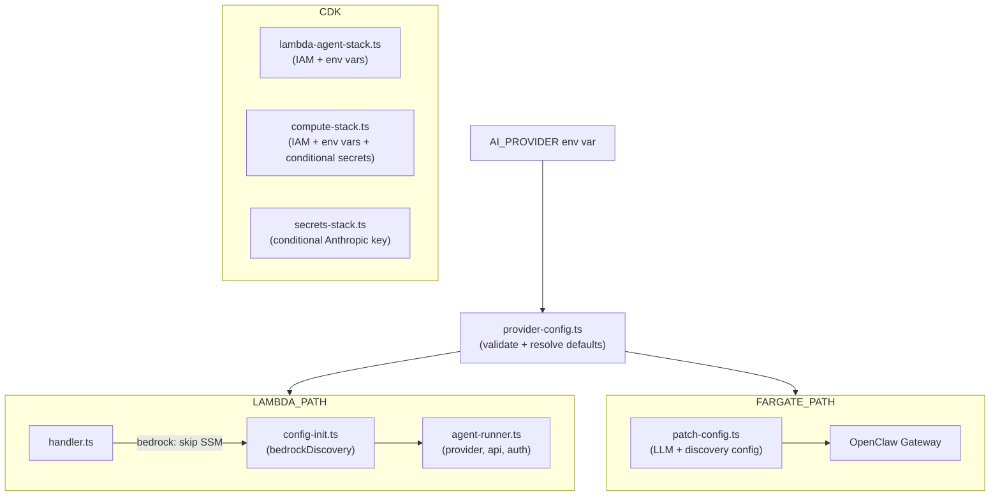

# Design Document: Bedrock API Support

## Overview

This feature adds Amazon Bedrock as an alternative AI provider alongside the existing Anthropic direct API. The system currently hardcodes `provider: "anthropic"` in `agent-runner.ts` and assumes an Anthropic API key is always present. This design introduces a provider abstraction driven by the `AI_PROVIDER` environment variable, enabling Bedrock's `bedrock-converse-stream` API via IAM role credentials — no additional API keys required.

The change touches both compute paths (Lambda Container Image and ECS Fargate), the CDK infrastructure (IAM, env vars, conditional secrets), and the OpenClaw config initialization layer. The design preserves full backward compatibility: when `AI_PROVIDER` is unset or `anthropic`, the system behaves identically to today.

### Key Design Decisions

1. **Environment-variable-driven, not config-file-driven**: Provider selection uses `AI_PROVIDER` (read at runtime), not a new config file. This aligns with the existing pattern where all deployment knobs are env vars.
2. **Static IAM permissions**: Bedrock IAM permissions are always provisioned regardless of `AI_PROVIDER`. IAM policies cost nothing and this avoids CDK drift when switching providers.
3. **Conditional secrets only**: The Anthropic API key SSM parameter and Fargate secret injection are the only things conditionally provisioned, since they require an actual value at deploy time.
4. **Shared provider config module**: A new `packages/shared/src/provider-config.ts` module centralizes provider/model/API defaults and validation, consumed by both Lambda and Fargate paths.

## Architecture

The provider selection flows through the system as follows:



### Lambda Path Changes

1. `handler.ts`: Reads `AI_PROVIDER`. When `bedrock`, skips SSM resolution for the Anthropic API key. Passes provider info to `initConfig()`.
2. `config-init.ts`: Accepts provider config. When `bedrock`, writes `models.bedrockDiscovery.enabled: true` with the configured region. When `anthropic`, keeps `enabled: false` (current behavior).
3. `agent-runner.ts`: Reads provider config to pass `provider`, `api`, and `model` to `runEmbeddedPiAgent()`. When `bedrock`: `provider: "amazon-bedrock"`, `api: "bedrock-converse-stream"`. No `ANTHROPIC_API_KEY` env var set.

### Fargate Path Changes

1. `patch-config.ts`: Accepts provider config. When `bedrock`, sets `llm.provider: "amazon-bedrock"`, `llm.api: "bedrock-converse-stream"`, removes `llm.apiKey`, and enables `models.bedrockDiscovery`. Also sets `process.env.AWS_PROFILE = "default"` (OpenClaw EC2/Fargate workaround).

### CDK Changes

1. `lambda-agent-stack.ts`: Adds Bedrock IAM permissions (always). Passes `AI_PROVIDER`, `AI_MODEL`, `AWS_REGION` env vars.
2. `compute-stack.ts`: Adds Bedrock IAM permissions (always). Passes `AI_PROVIDER`, `AI_MODEL`, `AWS_REGION` env vars. Conditionally includes/omits `ANTHROPIC_API_KEY` secret.
3. `secrets-stack.ts`: Conditionally skips Anthropic API key SSM parameter when `AI_PROVIDER=bedrock`.

## Components and Interfaces

### New Module: `packages/shared/src/provider-config.ts`

Centralizes provider validation and default resolution. Consumed by both compute paths.

```typescript
export type AiProvider = "anthropic" | "bedrock";

export interface ProviderConfig {
  provider: AiProvider;
  openclawProvider: string;   // "anthropic" | "amazon-bedrock"
  openclawApi: string;        // "anthropic" | "bedrock-converse-stream"
  openclawAuth: string;       // "api-key" | "aws-sdk"
  defaultModel: string;
  bedrockDiscovery: boolean;
}

export function resolveProviderConfig(env?: {
  AI_PROVIDER?: string;
  AI_MODEL?: string;
  AWS_REGION?: string;
}): ProviderConfig;

export function resolveModel(provider: AiProvider, aiModel?: string): string;

export function validateProvider(value: string): asserts value is AiProvider;
```

### Modified: `packages/lambda-agent/src/config-init.ts`

```typescript
interface InitConfigOptions {
  anthropicApiKey?: string;
  provider?: AiProvider;       // NEW
  awsRegion?: string;          // NEW
}
```

When `provider === "bedrock"`:
- `models.bedrockDiscovery.enabled` → `true`
- `models.bedrockDiscovery.region` → `awsRegion`
- Skip setting `ANTHROPIC_API_KEY` env var

### Modified: `packages/lambda-agent/src/handler.ts`

- Import `resolveProviderConfig` from shared
- When `bedrock`: skip SSM secret resolution for Anthropic key
- Pass `provider` and `awsRegion` to `initConfig()`
- Pass resolved model to `runAgent()`

### Modified: `packages/lambda-agent/src/agent-runner.ts`

```typescript
interface RunAgentParams {
  // ... existing fields ...
  provider?: string;           // NEW: "anthropic" | "amazon-bedrock"
  api?: string;                // NEW: "anthropic" | "bedrock-converse-stream"
}
```

The hardcoded `provider: "anthropic"` and `model: "claude-sonnet-4-20250514"` are replaced with values from `RunAgentParams`.

### Modified: `packages/container/src/patch-config.ts`

```typescript
interface PatchOptions {
  llmModel?: string;
  aiProvider?: AiProvider;     // NEW
  awsRegion?: string;          // NEW
}
```

When `aiProvider === "bedrock"`:
- Sets `llm.provider` to `"amazon-bedrock"`
- Sets `llm.api` to `"bedrock-converse-stream"`
- Removes `llm.apiKey`
- Sets `models.bedrockDiscovery.enabled` to `true` with region
- Sets `process.env.AWS_PROFILE = "default"`

### Modified: CDK Stacks

**`lambda-agent-stack.ts`**:
- Adds `AI_PROVIDER`, `AI_MODEL` (when set), `AWS_REGION` to Lambda environment
- Adds Bedrock IAM policy: `bedrock:InvokeModel`, `bedrock:InvokeModelWithResponseStream`, `bedrock:ListFoundationModels` on `*`

**`compute-stack.ts`**:
- Adds `AI_PROVIDER`, `AI_MODEL` (when set), `AWS_REGION` to container environment
- Adds Bedrock IAM policy to task role
- Conditionally includes `ANTHROPIC_API_KEY` secret only when `AI_PROVIDER !== "bedrock"`

**`secrets-stack.ts`**:
- Accepts `aiProvider` prop
- Conditionally skips Anthropic API key parameter when `aiProvider === "bedrock"`

## Data Models

### Provider Configuration (Runtime)

```typescript
// packages/shared/src/provider-config.ts

const PROVIDER_DEFAULTS = {
  anthropic: {
    openclawProvider: "anthropic",
    openclawApi: "anthropic",
    openclawAuth: "api-key",
    defaultModel: "claude-sonnet-4-20250514",
    bedrockDiscovery: false,
  },
  bedrock: {
    openclawProvider: "amazon-bedrock",
    openclawApi: "bedrock-converse-stream",
    openclawAuth: "aws-sdk",
    defaultModel: "anthropic.claude-sonnet-4-20250514-v1:0",
    bedrockDiscovery: true,
  },
} as const;
```

### OpenClaw Config JSON (Lambda path — `config-init.ts`)

When `bedrock`:
```json
{
  "gateway": { "mode": "local" },
  "models": {
    "bedrockDiscovery": {
      "enabled": true,
      "region": "eu-central-1"
    }
  }
}
```

When `anthropic` (unchanged):
```json
{
  "gateway": { "mode": "local" },
  "models": {
    "bedrockDiscovery": { "enabled": false }
  }
}
```

### OpenClaw Config JSON (Fargate path — `patch-config.ts`)

When `bedrock`, the LLM section becomes:
```json
{
  "llm": {
    "model": "anthropic.claude-sonnet-4-20250514-v1:0",
    "provider": "amazon-bedrock",
    "api": "bedrock-converse-stream"
  },
  "models": {
    "bedrockDiscovery": {
      "enabled": true,
      "region": "eu-central-1"
    }
  }
}
```

### CDK Props Extensions

```typescript
// secrets-stack.ts
export interface SecretsStackProps extends cdk.StackProps {
  aiProvider?: string;  // NEW — "anthropic" | "bedrock"
}

// compute-stack.ts — ComputeStackProps
aiProvider?: string;    // NEW — controls conditional secret injection

// lambda-agent-stack.ts — LambdaAgentStackProps
aiProvider?: string;    // NEW — for env var propagation
aiModel?: string;       // NEW — optional model override
```

### Environment Variables (New)

| Variable | Where | Values | Default |
|----------|-------|--------|---------|
| `AI_PROVIDER` | Lambda + Fargate | `anthropic`, `bedrock` | `anthropic` |
| `AI_MODEL` | Lambda + Fargate | Any valid model ID | Provider-specific default |
| `AWS_REGION` | Fargate (already in Lambda) | AWS region code | Required for Bedrock discovery |


## Correctness Properties

*A property is a characteristic or behavior that should hold true across all valid executions of a system — essentially, a formal statement about what the system should do. Properties serve as the bridge between human-readable specifications and machine-verifiable correctness guarantees.*

### Property 1: Provider validation accepts valid values and rejects invalid values with descriptive errors

*For any* string value, `validateProvider(value)` either succeeds (when the value is `"anthropic"` or `"bedrock"`) or throws an error whose message contains the invalid value string.

**Validates: Requirements 1.1, 1.5**

### Property 2: Model override takes precedence over provider defaults

*For any* valid provider (`"anthropic"` or `"bedrock"`) and *for any* non-empty model string, `resolveModel(provider, modelString)` returns the exact model string, ignoring the provider's default.

**Validates: Requirements 2.1**

### Property 3: Bedrock discovery region matches input region

*For any* non-empty region string, when `initConfig` is called with `provider: "bedrock"` and `awsRegion: regionString`, the written OpenClaw config JSON contains `models.bedrockDiscovery.region` equal to that exact region string, and `models.bedrockDiscovery.enabled` is `true`.

**Validates: Requirements 3.1, 3.2**

### Property 4: Provider config internal consistency

*For any* valid provider, `resolveProviderConfig({ AI_PROVIDER: provider })` produces a `ProviderConfig` where: if `provider === "bedrock"` then `bedrockDiscovery === true` and `openclawAuth === "aws-sdk"` and `openclawApi === "bedrock-converse-stream"`, and if `provider === "anthropic"` then `bedrockDiscovery === false` and `openclawAuth === "api-key"` and `openclawProvider === "anthropic"`.

**Validates: Requirements 1.3, 1.4, 3.1, 3.3, 9.1, 9.2**

## Error Handling

### Provider Validation Errors

- **Invalid `AI_PROVIDER` value**: `validateProvider()` throws a descriptive error at startup: `"Unsupported AI_PROVIDER: '${value}'. Valid values: anthropic, bedrock"`. This fails fast before any config initialization or secret resolution.
- **Where validated**: In `handler.ts` (Lambda path) and `patch-config.ts` caller (Fargate path), both at process startup before any OpenClaw interaction.

### Secret Resolution Errors

- **Bedrock path**: SSM resolution for Anthropic API key is skipped entirely. No error possible from missing key.
- **Anthropic path**: Existing behavior preserved — if SSM resolution fails, the Lambda returns `{ success: false, error: "..." }`.
- **Missing `AWS_REGION` when bedrock**: `resolveProviderConfig()` logs a warning but does not fail — Bedrock discovery will use the SDK's default region. The region is always available in Lambda (set by the runtime) and in Fargate (passed via CDK env var).

### CDK Deployment Errors

- **Bedrock + missing Anthropic key**: When `AI_PROVIDER=bedrock`, the Secrets Stack skips the Anthropic API key CfnParameter entirely, so no CloudFormation parameter is required. Deployment succeeds without it.
- **Anthropic + missing Anthropic key**: Existing behavior — CloudFormation fails if the parameter is not provided.

### Runtime Bedrock Errors

- **IAM permission denied**: Bedrock API calls fail with `AccessDeniedException`. The error propagates through OpenClaw's `runEmbeddedPiAgent()` and surfaces in the `LambdaAgentResponse.error` field or Fargate bridge error response. No special handling needed — existing error paths cover this.
- **Model not available in region**: Bedrock returns `ValidationException`. Same propagation path as above.

### Backward Compatibility

- All error paths for the existing Anthropic flow are unchanged.
- The `initialized` flag in `handler.ts` continues to gate cold-start initialization, ensuring config + secrets are resolved exactly once per Lambda instance regardless of provider.

## Testing Strategy

### Property-Based Testing

Property-based tests use **fast-check** (via Vitest) with a minimum of 100 iterations per property. Each test is tagged with a comment referencing the design property.

| Property | Test Location | What It Generates |
|----------|--------------|-------------------|
| Property 1: Provider validation | `packages/shared/__tests__/provider-config.test.ts` | Random strings (including edge cases: empty, whitespace, unicode, near-misses like "Anthropic", "BEDROCK") |
| Property 2: Model override | `packages/shared/__tests__/provider-config.test.ts` | Random non-empty strings × valid providers |
| Property 3: Bedrock discovery region | `packages/lambda-agent/__tests__/config-init.test.ts` | Random region-like strings |
| Property 4: Provider config consistency | `packages/shared/__tests__/provider-config.test.ts` | The two valid providers (`"anthropic"`, `"bedrock"`) with random AI_MODEL and AWS_REGION combinations |

Each property-based test MUST be implemented as a single `it` block with a comment:
```typescript
// Feature: bedrock-api-support, Property 1: Provider validation accepts valid values and rejects invalid values with descriptive errors
```

### Unit Tests (Examples and Edge Cases)

Unit tests cover specific scenarios from the acceptance criteria that are not properties:

**`packages/shared/__tests__/provider-config.test.ts`**:
- Default provider is `anthropic` when `AI_PROVIDER` is unset (Req 1.2)
- Bedrock defaults to model `anthropic.claude-sonnet-4-20250514-v1:0` (Req 2.3)
- Anthropic defaults to model `claude-sonnet-4-20250514` (Req 2.2)

**`packages/lambda-agent/__tests__/config-init.test.ts`**:
- Bedrock: writes `bedrockDiscovery.enabled: true` (Req 3.1)
- Anthropic: writes `bedrockDiscovery.enabled: false` (Req 3.3)
- Bedrock: does not set `ANTHROPIC_API_KEY` env var (Req 9.3)

**`packages/lambda-agent/__tests__/handler.test.ts`**:
- Bedrock: skips SSM resolution for Anthropic key (Req 4.2)
- Anthropic: resolves Anthropic key from SSM (Req 4.3)

**`packages/lambda-agent/__tests__/agent-runner.test.ts`**:
- Bedrock: passes `amazon-bedrock` provider, `bedrock-converse-stream` API, `aws-sdk` auth (Req 1.3, 9.1, 9.2)
- Anthropic: passes `anthropic` provider (Req 1.4)
- Response includes `provider` and `model` fields (Req 9.4)

**`packages/container/__tests__/patch-config.test.ts`**:
- Bedrock: sets `llm.provider`, `llm.api`, removes `apiKey` (Req 10.1, 10.2)
- Bedrock: enables `bedrockDiscovery` (Req 3.4)
- Bedrock: sets `AWS_PROFILE=default` (Req 4.4)
- Anthropic: preserves current behavior (Req 3.5, 10.3)

**`packages/cdk/__tests__/stacks.e2e.test.ts`** (CDK synth assertions):
- Lambda stack has Bedrock IAM permissions (Req 5.1-5.3)
- Compute stack has Bedrock IAM permissions (Req 5.4-5.6)
- Lambda stack passes `AI_PROVIDER` env var (Req 6.1)
- Compute stack passes `AI_PROVIDER`, `AWS_REGION` env vars (Req 6.3, 6.5)
- Compute stack omits `ANTHROPIC_API_KEY` secret when bedrock (Req 6.6)
- Compute stack includes `ANTHROPIC_API_KEY` secret when anthropic (Req 6.7)
- Secrets stack skips Anthropic key when bedrock (Req 7.1)
- Secrets stack provisions Anthropic key when anthropic (Req 7.2)

### Test Configuration

- **PBT library**: `fast-check` (already available in the ecosystem, works with Vitest)
- **Minimum iterations**: 100 per property test
- **Test runner**: `vitest run` (no watch mode)
- **CDK tests**: Use `aws-cdk-lib/assertions` `Template.fromStack()` for CloudFormation assertions
