# OpenClaw Architecture & Operation Sequence Analysis

> Analysis target: OpenClaw v2026.2.25 | Purpose: Serverless-ification planning

## Table of Contents

1. [Overview](#1-overview)
2. [High-Level Architecture](#2-high-level-architecture)
3. [Gateway Server](#3-gateway-server)
4. [Gateway Protocol Specification](#4-gateway-protocol-specification)
5. [Complete API Surface](#5-complete-api-surface)
6. [Chat.send Execution Sequence](#6-chatsend-execution-sequence)
7. [Agent Runtime Model](#7-agent-runtime-model)
8. [State Management Analysis](#8-state-management-analysis)
9. [Serverless-ification Analysis](#9-serverless-ification-analysis)
10. [Current serverless-openclaw Integration Points](#10-current-serverless-openclaw-integration-points)

---

## 1. Overview

OpenClaw is a multi-channel AI assistant platform that runs LLM-powered agents with tool-calling capabilities across 15+ messaging channels.

### Tech Stack

| Component | Technology |
|-----------|-----------|
| Runtime | Node.js >= 22.12.0 |
| Language | TypeScript ES2023, strict mode |
| Package Manager | pnpm 10.x (monorepo workspaces) |
| Bundler | tsdown (entry-based) |
| Test Runner | vitest 4.x (fork pool, 70% coverage threshold) |
| Linter/Formatter | oxlint + oxfmt |

### Scale

| Metric | Count |
|--------|-------|
| Source modules (`src/`) | 69 directories |
| Extensions | 40 modules |
| Skills | 54 modules |
| CLI commands | 250+ implementation files |
| Gateway methods | 86+ |
| Total TypeScript | ~675K lines |

### Entry Points

| Entry | File | Purpose |
|-------|------|---------|
| CLI | `openclaw.mjs` → `src/entry.ts` | Interactive CLI (Commander.js) |
| Gateway | `openclaw gateway run` | WebSocket + HTTP server on port 18789 |
| Library | `dist/index.js` | Programmatic import |
| Plugin SDK | `dist/plugin-sdk/index.js` | Extension development API |

### Key Dependencies

| Category | Libraries |
|----------|----------|
| AI/LLM | `@mariozechner/pi-ai`, `@mariozechner/pi-coding-agent`, `@agentclientprotocol/sdk` |
| Messaging | grammY (Telegram), discord.js, @slack/bolt, LINE SDK, @whiskeysockets/baileys (WhatsApp) |
| Server | Express, ws (WebSocket) |
| Validation | zod, ajv, @sinclair/typebox |
| CLI | commander, @clack/prompts, chalk |
| Media | sharp, pdfjs-dist, playwright-core |
| Database | node:sqlite (built-in), sqlite-vec (optional SIMD vectors) |

---

## 2. High-Level Architecture

```mermaid
graph TB
    subgraph "Clients"
        CLI[CLI Client]
        ControlUI[Control UI]
        WebChat[WebChat UI]
        Channels[Channel Plugins]
        Nodes[Remote Nodes]
    end

    subgraph "Gateway Server :18789"
        WS[WebSocket Server]
        HTTP[HTTP Endpoints]
        Auth[Auth Layer\ntoken / password / device-token]
        MethodRouter[Method Router\n86+ RPC methods]
    end

    subgraph "Agent Runtime"
        Dispatch[Auto-Reply Dispatcher]
        PiAgent[Pi Agent Runtime\nEmbedded Mode]
        Tools[Tool System\nbash / read / write / edit / MCP]
        SessionMgr[Session Manager\nJSONL Transcripts]
    end

    subgraph "LLM Providers"
        Anthropic[Anthropic API]
        OpenAI[OpenAI API]
        Others[Ollama / Bedrock / Vertex / etc.]
    end

    subgraph "Persistent Storage"
        Config["~/.openclaw/openclaw.json"]
        Sessions["~/.openclaw/agents/{id}/sessions/"]
        Memory["SQLite Vector Store"]
        Identity["~/.openclaw/identity/"]
        Cron["~/.openclaw/cron/"]
    end

    subgraph "Channel Integrations"
        TG[Telegram\ngrammY]
        Discord[Discord\ndiscord.js]
        Slack[Slack\n@slack/bolt]
        WA[WhatsApp\nBaileys]
        More[Signal / LINE / Matrix / Teams / ...]
    end

    CLI --> WS
    ControlUI --> WS
    WebChat --> WS
    Nodes --> WS
    Channels --> HTTP

    WS --> Auth
    HTTP --> Auth
    Auth --> MethodRouter
    MethodRouter --> Dispatch
    Dispatch --> PiAgent
    PiAgent --> Tools
    PiAgent --> SessionMgr
    PiAgent --> Anthropic
    PiAgent --> OpenAI
    PiAgent --> Others
    SessionMgr --> Sessions
    SessionMgr --> Memory

    MethodRouter --> Config
    MethodRouter --> Cron
    MethodRouter --> Identity

    TG --> HTTP
    Discord --> HTTP
    Slack --> HTTP
    WA --> HTTP
    More --> HTTP
```

### Client Types

| Client | Connection | Role | Description |
|--------|-----------|------|-------------|
| CLI | WebSocket | operator | Interactive terminal client |
| Control UI | WebSocket | operator | Local web dashboard for configuration and session management |
| WebChat UI | WebSocket | operator | Browser-based chat interface |
| Remote Nodes | WebSocket | node | CLI/iOS/Android devices providing capabilities (browser, shell) |
| Channel Plugins | HTTP/WS | internal | Telegram, Discord, Slack, etc. — message bridging |

---

## 3. Gateway Server

### Initialization

The gateway starts via `startGatewayServer()` in `src/gateway/server.impl.ts`.

| Parameter | Default | Description |
|-----------|---------|-------------|
| Port | 18789 | `--port` CLI flag |
| Bind | loopback | `--bind` flag: `loopback` / `lan` / `tailnet` / `auto` |
| Auth | token | `--auth` flag: `token` / `password` / `none` |
| TLS | off | Optional via `loadGatewayTlsRuntime()` |

### Startup Sequence

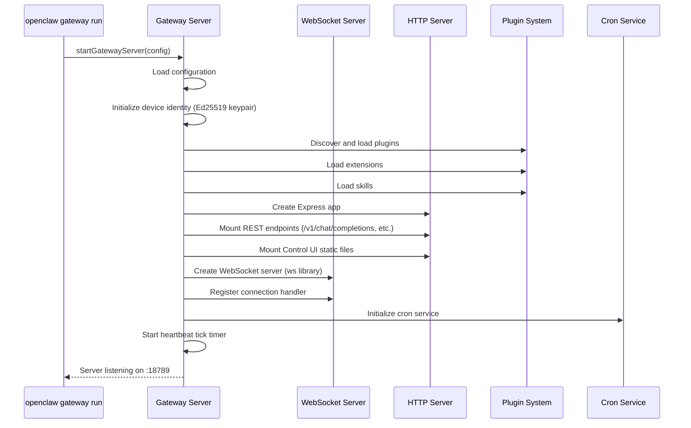

### Authentication Methods

| Method | Mechanism | Use Case |
|--------|-----------|----------|
| Token | Bearer token string | Programmatic access (serverless-openclaw uses this) |
| Password | Password string | Simple human-friendly auth |
| Device Token | Ed25519 signed challenge | Device pairing with cryptographic verification |

### Authorization Model

Two-layer authorization system:

1. **Role-based**: `operator` (default), `admin`, `node`
2. **Scope-based**: Fine-grained permissions with default-deny policy

Scope hierarchy (implications):
- `operator.admin` implies `operator.read`, `operator.write`, `operator.approvals`, `operator.pairing`
- `operator.write` implies `operator.read`

> **Important for serverless**: v2026.2.14+ introduced a default-deny scope system requiring device pairing. Without device pairing, `operator.write` scope is stripped, breaking chat functionality. This is why serverless-openclaw pins v2026.2.13.

---

## 4. Gateway Protocol Specification

### Frame Format

The protocol uses JSON-RPC 2.0 over WebSocket with 3 frame types as a discriminated union:

#### Request Frame

```json
{
  "type": "req",
  "id": "unique-request-id",
  "method": "method.name",
  "params": {}
}
```

#### Response Frame

```json
{
  "type": "res",
  "id": "matching-request-id",
  "ok": true,
  "payload": {}
}
```

Error response:

```json
{
  "type": "res",
  "id": "matching-request-id",
  "ok": false,
  "error": {
    "code": "ERROR_CODE",
    "message": "Human-readable message",
    "details": {}
  }
}
```

#### Event Frame

```json
{
  "type": "event",
  "event": "event.name",
  "payload": {},
  "seq": 123,
  "stateVersion": { "presence": 1, "health": 2 }
}
```

### Protocol Constants

| Constant | Description |
|----------|-------------|
| `MAX_PAYLOAD_BYTES` | Maximum single frame size |
| `MAX_BUFFERED_BYTES` | Maximum total buffered data per connection |
| `TICK_INTERVAL_MS` | Heartbeat interval |
| `HANDSHAKE_TIMEOUT_MS` | Time limit to complete handshake |

### Connection Lifecycle

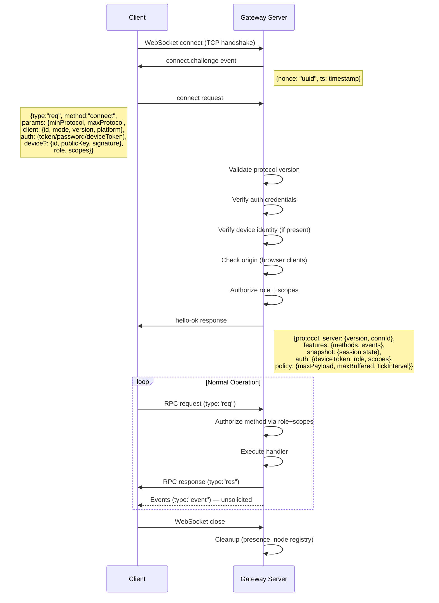

### ConnectParams — Client Identification

| Field | Valid Values | Description |
|-------|-------------|-------------|
| `client.id` | `cli`, `gateway-client`, `webchat-ui`, `control-ui`, ... | Client type identifier (TypeBox Literal) |
| `client.mode` | `cli`, `backend`, `ui`, `node`, ... | Operating mode (`operator` is invalid) |
| `client.version` | semver string | Client version |
| `client.platform` | `macos`, `linux`, `windows`, `web`, ... | Platform identifier |
| `device` | Optional | Ed25519 device identity (omit if not using device pairing) |

### Event Types

| Event | Payload | Description |
|-------|---------|-------------|
| `connect.challenge` | `{nonce, ts}` | Initial handshake challenge |
| `chat` | `{runId, sessionKey, seq, state, message, usage}` | Chat streaming (delta/final/error/aborted) |
| `presence` | Client presence data | Connected client typing/status indicators |
| `presence.snapshot` | Full presence state | Complete presence state snapshot |
| `shutdown` | `{reason, restartExpectedMs}` | Graceful shutdown notification |
| `health` | Health snapshot | Gateway health metrics |
| `config.updated` | Config delta | Configuration changed |
| `skills.updated` | Skills list | Available skills changed |
| `node.event` | Node event data | Remote node event forwarding |
| `tick` | `{ts}` | Periodic heartbeat |

---

## 5. Complete API Surface

### WebSocket Methods (86+)

#### Chat & Messaging

| Method | Type | Description |
|--------|------|-------------|
| `chat.send` | Long-running, Streaming | Send message to agent, receive streamed response |
| `chat.history` | Read-only | Retrieve conversation history |
| `chat.abort` | Stateful | Abort running agent execution |
| `chat.inject` | Stateful | Inject assistant message into transcript |

#### Sessions

| Method | Type | Description |
|--------|------|-------------|
| `sessions.list` | Read-only | List available sessions |
| `sessions.preview` | Read-only | Get session metadata |
| `sessions.resolve` | Read-only | Resolve session info |
| `sessions.patch` | Stateful | Update session settings |
| `sessions.reset` | Stateful | Create new session |
| `sessions.delete` | Stateful | Delete session |
| `sessions.compact` | Stateful | Compact session storage |
| `sessions.usage` | Read-only | Get usage statistics |
| `sessions.usage.logs` | Read-only | Usage log entries |
| `sessions.usage.timeseries` | Read-only | Time-series usage data |

#### Agents

| Method | Type | Description |
|--------|------|-------------|
| `agents.list` | Read-only | List agents |
| `agents.create` | Stateful | Create new agent |
| `agents.update` | Stateful | Update agent |
| `agents.delete` | Stateful | Delete agent |
| `agents.files.list` | Read-only | List agent files |
| `agents.files.get` | Read-only | Read agent file |
| `agents.files.set` | Stateful | Write agent file |
| `agent` | Long-running | Run agent |
| `agent.identity.get` | Read-only | Get agent identity |
| `agent.wait` | Long-running | Wait for agent job completion |

#### Configuration

| Method | Type | Description |
|--------|------|-------------|
| `config.get` | Read-only | Read configuration |
| `config.set` | Stateful | Set config value |
| `config.patch` | Stateful (rate-limited) | Patch config (3/60s) |
| `config.apply` | Stateful (rate-limited) | Apply config (3/60s) |
| `config.schema` | Read-only | Get config JSON schema |

#### Skills & Tools

| Method | Type | Description |
|--------|------|-------------|
| `skills.status` | Read-only | Get skill installation status |
| `skills.bins` | Read-only | List required binaries |
| `skills.install` | Stateful, Long-running | Install skill |
| `skills.update` | Stateful, Long-running | Update skill |
| `tools.catalog` | Read-only | List available tools |

#### Cron (Scheduling)

| Method | Type | Description |
|--------|------|-------------|
| `cron.list` | Read-only | List cron jobs |
| `cron.status` | Read-only | Get job status |
| `cron.add` | Stateful | Create cron job |
| `cron.update` | Stateful | Update job |
| `cron.remove` | Stateful | Delete job |
| `cron.run` | Long-running | Trigger job manually |
| `cron.runs` | Read-only | Get run history |

#### Devices & Pairing

| Method | Type | Description |
|--------|------|-------------|
| `device.pair.list` | Read-only | List paired devices |
| `device.pair.approve` | Stateful | Approve device |
| `device.pair.reject` | Stateful | Reject device |
| `device.pair.remove` | Stateful | Remove device |
| `device.token.rotate` | Stateful | Rotate auth token |
| `device.token.revoke` | Stateful | Revoke token |

#### Remote Nodes

| Method | Type | Description |
|--------|------|-------------|
| `node.list` | Read-only | List connected nodes |
| `node.describe` | Read-only | Get node details |
| `node.invoke` | Long-running | Execute command on node |
| `node.invoke.result` | Read-only | Retrieve command result |
| `node.event` | Stateful | Emit event to node |
| `node.pair.request` | Stateful, Long-running | Request node pairing |
| `node.pair.list` | Read-only | List pairing requests |
| `node.pair.approve` | Stateful | Approve node |
| `node.pair.reject` | Stateful | Reject node |
| `node.pair.verify` | Read-only | Verify node token |
| `node.rename` | Stateful | Rename node |

#### Browser, TTS, Voice, System

| Method | Type | Description |
|--------|------|-------------|
| `browser.request` | Long-running | Execute browser command on node |
| `tts.status` | Read-only | Get TTS status |
| `tts.convert` | Long-running | Convert text to speech |
| `tts.enable/disable/setProvider` | Stateful | TTS configuration |
| `voicewake.get/set` | Read-only / Stateful | Voice wake settings |
| `exec.approvals.*` | Read-only / Stateful | Tool execution approval policies |
| `wizard.start/next/cancel/status` | Stateful | Setup wizard |
| `system-presence` | Stateful | Client presence announcement |
| `logs.tail` | Streaming | Stream gateway logs |
| `health` | Read-only | Server health check |
| `models.list` | Read-only | List available LLM models |
| `send` | Long-running | Send message |
| `update.run` | Stateful, Long-running | Run system update |

### HTTP REST Endpoints

| Endpoint | Method | Description |
|----------|--------|-------------|
| `/v1/chat/completions` | POST | OpenAI-compatible chat completion (streaming supported) |
| `/v1/responses` | POST | OpenResponses specification endpoint |
| `/tools/invoke` | POST | Direct tool invocation |
| `/control-ui/*` | GET | Control UI SPA (static files) |
| `/a2ui/*`, `/canvas/*` | WS/GET | Canvas/A2UI WebSocket proxy |
| `/hooks/wake` | POST | Wake agent webhook |
| `/hooks/agent` | POST | Dispatch agent message webhook |
| `/hooks/{mapping}` | POST | Custom hook mappings |

### Method Type Summary

| Type | Count (approx.) | Characteristics |
|------|-----------------|----------------|
| **Read-only** | ~30 | No side effects, cacheable, stateless |
| **Stateful** | ~35 | Modifies config/sessions/devices on disk |
| **Long-running** | ~15 | Agent execution, skill install, node invoke |
| **Streaming** | ~5 | Chat events, log tailing, HTTP streaming |

---

## 6. Chat.send Execution Sequence

This is the critical path for serverless-ification — the most resource-intensive and latency-sensitive operation.

### Full Call Chain

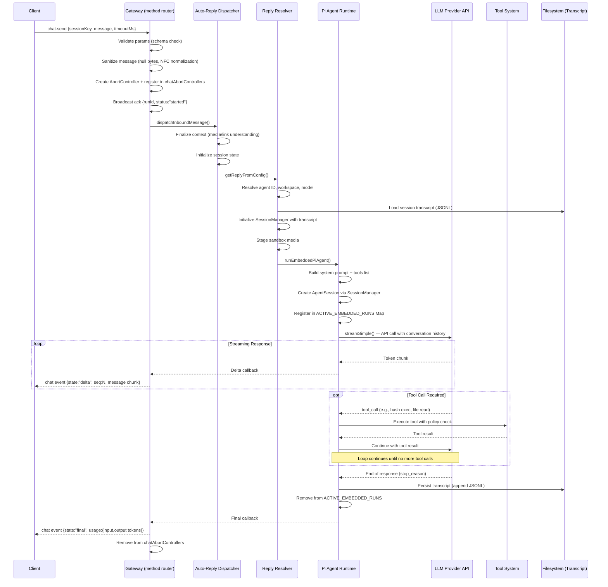

### Streaming States

| State | Meaning | Contains |
|-------|---------|----------|
| `delta` | Intermediate content chunk | Text fragment, tool call fragment |
| `final` | Complete response | Full message, usage metrics, stop reason |
| `aborted` | User-initiated abort | Partial response with abort metadata |
| `error` | Exception during execution | Error message |

### Chat Event Payload

```json
{
  "type": "event",
  "event": "chat",
  "payload": {
    "runId": "uuid",
    "sessionKey": "agent#session",
    "seq": 1,
    "state": "delta",
    "message": {
      "role": "assistant",
      "content": [{"type": "text", "text": "chunk..."}]
    },
    "usage": {
      "inputTokens": 1500,
      "outputTokens": 200,
      "cacheRead": 1000,
      "cacheWrite": 500
    },
    "stopReason": "end_turn"
  }
}
```

### Abort Flow

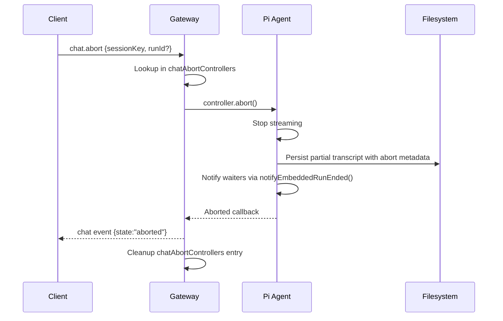

### Timeouts

| Parameter | Default | Range | Description |
|-----------|---------|-------|-------------|
| Default timeout | 600s (10 min) | 1ms — 2,147,000,000ms (~24 days) | `cfg.agents.defaults.timeoutSeconds` |
| Per-request override | — | — | `timeoutMs` parameter in chat.send |
| Zero timeout | — | — | Treated as "no timeout" (MAX_SAFE_TIMEOUT_MS) |

### Idempotency

- `idempotencyKey` parameter in chat.send request
- Stored as `clientRunId` in `chatAbortControllers` Map
- Prevents duplicate agent runs for the same request

---

## 7. Agent Runtime Model

### Pi Agent Runtime

OpenClaw uses `@mariozechner/pi-coding-agent` (SessionManager) and `@mariozechner/pi-ai` (streamSimple) for agent execution.

#### Execution Modes

| Mode | Mechanism | Use Case |
|------|-----------|----------|
| **Embedded** (primary) | In-process via `runEmbeddedPiAgent()` | Normal gateway operation. Agent runs inline with the WebSocket handler. |
| **CLI** (fallback) | Subprocess via `runCliAgent()` | Isolation scenarios. Spawns OpenClaw as a child process. |

### Session Management

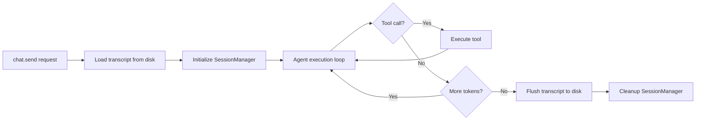

- **Session key format**: `AGENT_ID#SESSION_ID` or just `SESSION_ID` (defaults to default agent)
- **Transcript format**: JSONL (JSON Lines), append-only
- **Transcript persistence**: Flushed after each assistant message turn
- **Compaction**: Large session files are compacted in-place to reduce size
- **Cache TTL**: 45 seconds for session index (configurable via `OPENCLAW_SESSION_CACHE_TTL_MS`)

### Transcript Format (JSONL)

```jsonl
{"type":"session","version":1,"id":"session-id","timestamp":"..."}
{"message":{"role":"user","content":"Hello","timestamp":1234567890}}
{"message":{"role":"assistant","content":[{"type":"text","text":"Hi!"}],"timestamp":1234567891}}
```

### Tool System

Built-in tools provided via `createOpenClawCodingTools()`:

| Tool | Description | Resource Impact |
|------|-------------|-----------------|
| `exec` | Bash command execution (sandboxed) | Spawns child process |
| `read` | File reading (workspace-scoped) | File handle (open/close per call) |
| `write` | File writing (workspace-scoped) | File handle (open/close per call) |
| `edit` | Inline file editing | File handle |
| MCP tools | Plugin-provided tools | Varies |

**Policy Layer** (tool execution pipeline):
1. `resolveEffectiveToolPolicy()` — Check if tool is allowed
2. `wrapToolWithAbortSignal()` — Pass abort signal for cancellation
3. `wrapToolWithBeforeToolCallHook()` — Plugin hooks (before_tool_call)
4. Bash approval system — User approval for sensitive commands (`exec-approval-manager.ts`)

### Concurrency Model

| Scope | Concurrency | Mechanism |
|-------|-------------|-----------|
| Per-session | Serial (one run at a time) | New run replaces old via `setActiveEmbeddedRun()` |
| Cross-session | Fully parallel | Independent SessionManager instances |
| Message queuing | In-memory queue per session | `queueEmbeddedPiMessage(sessionId, text)` — only during active streaming |

### Agent Run Tracking

Two tracking mechanisms operate in parallel:

| Map | Scope | Key | Value |
|-----|-------|-----|-------|
| `chatAbortControllers` | Gateway-level | `clientRunId` | `{controller, sessionKey, sessionId, startedAtMs, expiresAtMs}` |
| `ACTIVE_EMBEDDED_RUNS` | Agent runtime-level | `sessionId` | `{queueMessage(), isStreaming(), isCompacting(), abort()}` |

### Resource Profile Per Agent Run

| Resource | Usage | Notes |
|----------|-------|-------|
| Memory | 1-10 MB per session | Depends on conversation history size |
| File handles | 1 per active run (transcript) | Plus temporary handles for tool calls |
| Child processes | 0-N per tool call | Bash `exec` spawns processes, cleaned up on exit |
| CPU | I/O bound (streaming) | CPU-intensive only during tool execution |
| Write lock | 1 file lock per session | `session-write-lock.ts` prevents concurrent transcript corruption |

### Model Provider Integration

LLM API calls are made via `streamSimple()` from `@mariozechner/pi-ai`:

| Provider | Client Library | Auth |
|----------|---------------|------|
| Anthropic | Pi-AI built-in | API key via env/config |
| OpenAI | Pi-AI built-in | API key via env/config |
| Ollama | `createOllamaStreamFn()` | Local (no auth) |
| AWS Bedrock | `@aws-sdk/client-bedrock` | IAM credentials |
| Google Vertex | Vertex SDK | Service account |

Key files: `src/agents/model-selection.ts`, `src/agents/model-auth.ts`, `src/agents/models-config.ts`

---

## 8. State Management Analysis

### Complete State Inventory

#### Persistent On-Disk

| Component | Format | Location | Scope | Size | Access Pattern |
|-----------|--------|----------|-------|------|---------------|
| Configuration | JSON5 | `~/.openclaw/openclaw.json` | Per-host | ~1-5 KB | Read on startup, write on config.set |
| Sessions index | JSON | `agents/{id}/sessions/sessions.json` | Per-agent | ~10-100 KB | Read/write per session operation |
| Session transcripts | JSONL | `agents/{id}/sessions/{sid}.jsonl` | Per-session | 1 KB - 10 MB | Append-only, compacted periodically |
| Cron jobs | JSON | `cron/jobs.json` | Global | ~1-5 KB | Read/write per cron operation |
| Device identity | JSON | `identity/device.json` | Per-device | ~1 KB | Read on startup, generated once |
| Device auth tokens | JSON | `identity/device-auth.json` | Per-device | ~1 KB | Read/write per auth operation |
| Pending pairings | JSON | `pairing/pending.json` | Global | ~1 KB | 5-minute TTL, pruned on load |
| Paired devices | JSON | `pairing/paired.json` | Global | ~1-5 KB | Read/write per pairing operation |
| Memory vectors | SQLite | `agents/{id}/<ws>/index.sqlite` | Per-agent | 1-100 MB | Read/write per memory operation |
| OAuth tokens | JSON | `credentials/oauth.json` | Global | ~1 KB | Read/write per OAuth flow |
| Boot instructions | Markdown | `{workspace}/BOOT.md` | Per-agent | ~1 KB | Read once on boot |

#### Ephemeral In-Memory

| Component | Data Structure | Scope | Lifetime | Size |
|-----------|---------------|-------|----------|------|
| WebSocket connections | Connection registry | Per-connection | Connection lifetime | ~1 KB each |
| Active agent runs | `ACTIVE_EMBEDDED_RUNS` Map | Per-session | Run lifetime (up to 10 min) | 1-10 MB each |
| Chat abort controllers | `chatAbortControllers` Map | Per-request | Run lifetime | ~100 B each |
| System presence | Map (max 200 entries) | Multi-client | 5-minute TTL | ~50 KB total |
| Session index cache | TTL cache (45s) | Per-agent | 45 seconds | 10-100 KB |
| Memory index cache | `INDEX_CACHE` Map | Per-agent workspace | Process lifetime | 1-100 MB |
| File watchers | FSWatcher instances | Per-agent directory | Process lifetime | ~1 KB each |
| Cron service state | Timer + running flag | Global | Process lifetime | ~1 KB |

### Externalization Feasibility

| Component | Current | Target | Feasibility | Effort |
|-----------|---------|--------|-------------|--------|
| Config | JSON5 file | S3 or DynamoDB | High | Low |
| Sessions index | JSON file | DynamoDB | High | Medium |
| Session transcripts | JSONL files | S3 | High | Medium (need streaming read/write) |
| Cron jobs | JSON file | DynamoDB + EventBridge | High | Medium |
| Device identity | JSON file | SSM Parameter Store | High | Low |
| Device pairing | JSON files | DynamoDB | High | Low |
| Memory vectors | SQLite + sqlite-vec | pgvector or managed vector DB | Medium | High (query compatibility) |
| OAuth tokens | JSON file | Secrets Manager | High | Low |
| WS connections | In-memory | API Gateway manages | Already done in serverless-openclaw | — |
| Active runs | In-memory Map | DynamoDB + Step Functions | Low | Very High (requires architecture change) |
| Presence | In-memory Map | DynamoDB or ElastiCache | Medium | Medium |

---

## 9. Serverless-ification Analysis

### Current Architecture (serverless-openclaw)

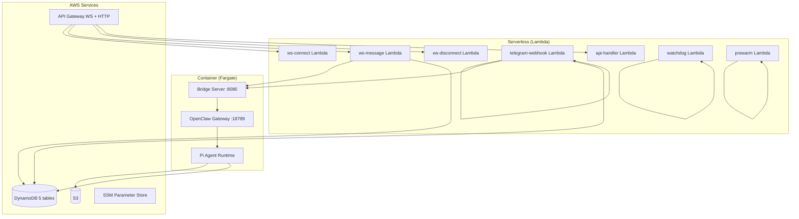

### Fundamental Blockers for Full Lambda Migration

| # | Blocker | Technical Reason | Severity |
|---|---------|-----------------|----------|
| 1 | **Persistent WebSocket server** | OpenClaw Gateway requires a long-lived WS server on port 18789. The Bridge connects as a WS client and maintains the connection for the container lifetime. Lambda cannot maintain persistent WS server connections. | Critical |
| 2 | **Long-lived agent runs** | Agent execution can run up to 10 minutes (default) with multiple LLM round-trips and tool calls. Lambda has a 15-minute hard limit, and Lambda Response Streaming has constraints on idle timeout. | Critical |
| 3 | **In-process tool execution** | Tools (`exec`, `read`, `write`, `edit`) require a persistent filesystem with workspace isolation. Lambda's `/tmp` is ephemeral (512 MB - 10 GB) and lost between invocations. | High |
| 4 | **Session transcript persistence** | Append-only JSONL transcripts need local disk for efficient streaming writes. Flushing every turn to S3 would add latency and cost. | High |
| 5 | **Memory vector store** | SQLite-based vector database needs persistent volume. Cannot run in Lambda's ephemeral storage across invocations. | Medium |
| 6 | **Plugin/extension loading** | Gateway loads 40+ extensions and 54 skills at startup (~30-35s). This initialization time exceeds acceptable Lambda cold start. | High |
| 7 | **In-memory state coupling** | Active runs, presence, and session caches are in-process. No external state store interface exists. | Medium |

### What Is Already Serverless-Friendly

The following components in serverless-openclaw are already running as Lambda functions:

| Component | Lambda Function | Description |
|-----------|----------------|-------------|
| WebSocket routing | ws-connect, ws-message, ws-disconnect | Connection management, message routing to Bridge |
| Telegram webhook | telegram-webhook | Webhook validation, message extraction, routing |
| REST API | api-handler | Conversations, status, identity linking |
| Health monitoring | watchdog | Container health check, stale task cleanup |
| Pre-warming | prewarm | Trigger ECS RunTask for warm container pool |

### Potential Serverless Migration Targets

#### Tier 1: Feasible with Minimal Upstream Changes

| Target | Current | Proposed | Prerequisites |
|--------|---------|----------|---------------|
| Config read/write | Gateway WS method | Lambda + DynamoDB | Config stored in DDB instead of file |
| Sessions list/metadata | Gateway WS method | Lambda + DynamoDB | Session index in DDB |
| Device pairing | Gateway WS method | Lambda + DynamoDB | Pairing state in DDB |
| Cron scheduling | In-process timer | EventBridge + Lambda | Job store in DDB |
| Models list | Gateway WS method | Lambda + static config | Model catalog in S3/DDB |

#### Tier 2: Feasible with Moderate Upstream Changes

| Target | Current | Proposed | Prerequisites |
|--------|---------|----------|---------------|
| Short agent runs (< 5 min) | In-process Pi Agent | Lambda + Response Streaming | OpenClaw library mode (decouple from gateway server) |
| Session transcript read | File system read | Lambda + S3 | Transcripts stored in S3 |
| Skill status/catalog | Gateway + filesystem | Lambda + DynamoDB | Skill registry in DDB |

#### Tier 3: Requires Significant Upstream Architectural Changes

| Target | Current | Proposed | Prerequisites |
|--------|---------|----------|---------------|
| Full agent execution | In-process with tool calls | Step Functions + Lambda | Externalize SessionManager state, tool execution isolation |
| Memory/vector search | SQLite in-process | Lambda + managed vector DB | Replace sqlite-vec with API-based vector service |
| Tool execution (bash) | In-process child process | Lambda with EFS or container | Workspace mounted on EFS, security sandbox |

### Architectural Options for Deeper Serverless-ification

#### Option A: OpenClaw as Library

Import the Pi Agent runtime directly into Lambda, bypassing the Gateway server entirely.

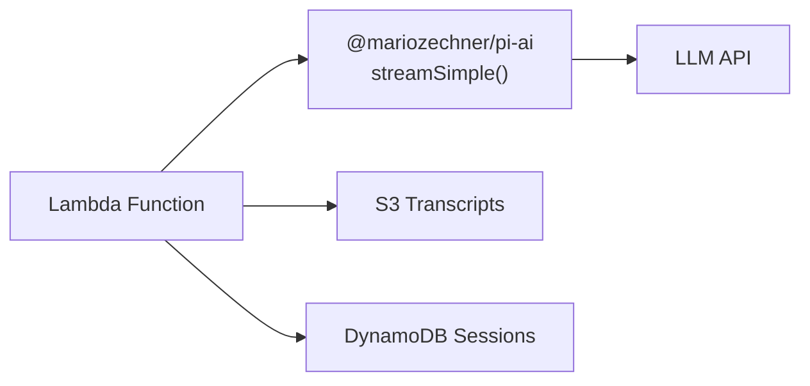

**Pros**: Maximum serverless-ification, no container needed for basic chat
**Cons**: Requires decoupling Pi Agent from gateway context; tool execution limited; plugin/skill system unavailable; cold start for npm dependencies

#### Option B: OpenClaw HTTP API Mode

Use the `/v1/chat/completions` HTTP endpoint as a standalone service (without WS Gateway).

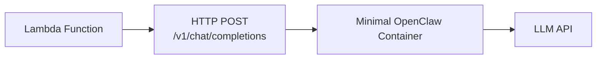

**Pros**: Leverages existing HTTP endpoint; full OpenClaw features available
**Cons**: Still requires container; just changes the protocol (HTTP instead of WS); doesn't eliminate Fargate

#### Option C: Split Gateway — Control Plane + Execution Plane

Separate the Gateway into a stateless control plane (Lambda) and a minimal execution plane (container).

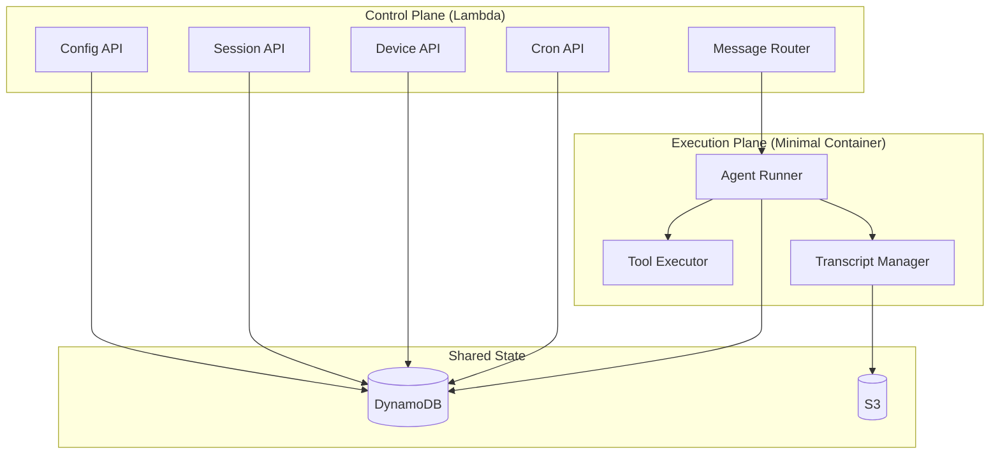

**Pros**: Maximizes serverless surface area; container only runs for agent execution; fast Lambda responses for all non-chat operations
**Cons**: Requires significant refactoring of serverless-openclaw; need to implement all control plane methods as Lambda handlers; state synchronization complexity

### Recommendation

**Option C (Split Gateway)** provides the best balance of serverless-ification and compatibility:

1. **Phase 1** (current): Lambda routing + Fargate container (already implemented)
2. **Phase 2** (Tier 1): Move config/sessions/device APIs to Lambda + DynamoDB
3. **Phase 3** (Tier 2): Implement OpenClaw library mode for short agent runs
4. **Phase 4** (Tier 3): Full control plane extraction with minimal execution container

Each phase is independently deployable and provides incremental cost/latency benefits.

---

## 10. Current serverless-openclaw Integration Points

### Bridge Server (:8080)

The Bridge server in the Fargate container acts as an HTTP-to-WebSocket proxy:

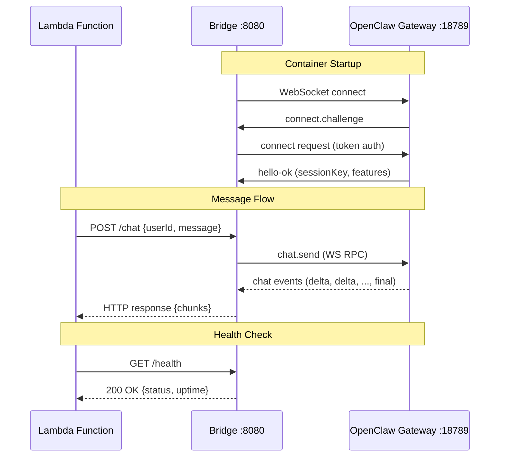

### OpenClaw Client (`openclaw-client.ts`)

Key methods in the container's OpenClaw client:

| Method | Purpose |
|--------|---------|
| `connect()` | WebSocket handshake with challenge-response |
| `sendMessage(sessionKey, message)` | `chat.send` RPC call |
| `onChatEvent(callback)` | Subscribe to streaming chat events |
| `waitForReady()` | Block until hello-ok received |

### Container Startup Sequence

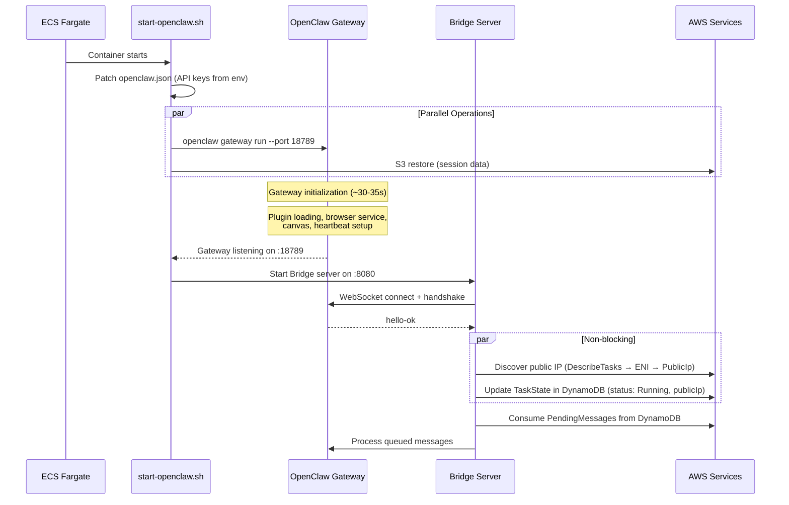

### Message Routing Decision Tree

The Lambda `routeMessage` service implements the following logic:

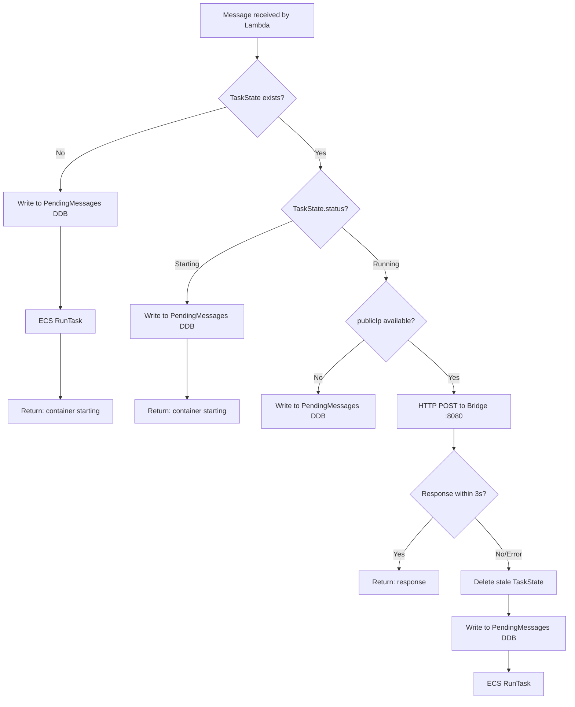

### Integration Configuration

| Parameter | Value | Description |
|-----------|-------|-------------|
| Gateway port | 18789 | OpenClaw Gateway WebSocket |
| Bridge port | 8080 | HTTP proxy for Lambda access |
| Bridge HTTP timeout | 3000ms | `BRIDGE_HTTP_TIMEOUT_MS` |
| Auth token | SSM SecureString | `/serverless-openclaw/secrets/bridge-auth-token` |
| Gateway token | SSM SecureString | `/serverless-openclaw/secrets/openclaw-gateway-token` |
| Client ID | `gateway-client` | ConnectParams.client.id |
| Client mode | `backend` | ConnectParams.client.mode |
| OpenClaw version | v2026.2.13 | Pinned (v2026.2.14 breaks due to scope system) |
